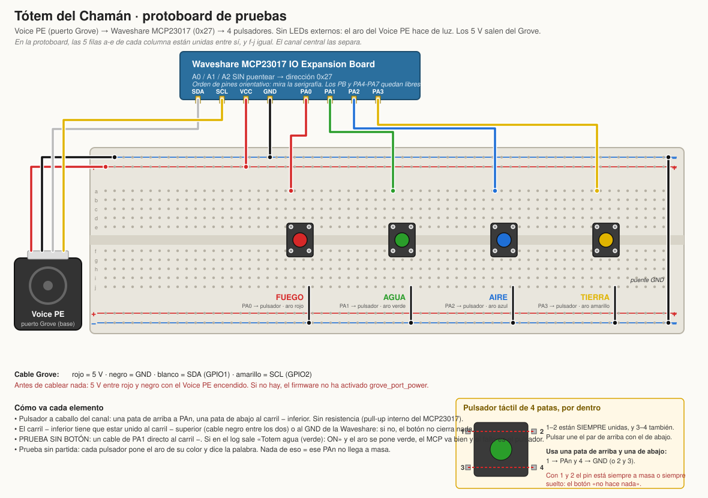

# Bombshot v2 — El Tótem del Chamán

Plan de la segunda versión del juguete, para la fiesta **dino-neandertal**.
Mismo Voice PE que la v1, juego completamente distinto y caja nueva
ambientada en el disfraz de chamán de la tribu (máscara, collar de huesos).

Estado a 2026-09-11: **versión mínima flasheada y con los cuatro
pulsadores funcionando en protoboard.** El 2026-09-11 se simplificó a
fondo para llegar a tiempo: **sin LEDs externos** (el aro del Voice PE
hace de luz) y **sin más audio que las cuatro palabras** (fuego, agua,
aire, tierra). Lo que sigue describe esa versión; lo que se quitó queda
en git (commits `9fb62ee` y `3d1e85c`) por si se recupera.

## 1. El juego

Un **Simon ritual de los cuatro elementos**: fuego, agua, aire y tierra.
El altar es la caja; sobre la "roca" hay cuatro piedras o tótems, uno por
elemento, cada uno con un pulsador y una luz de su color debajo. El Voice
PE va escondido dentro con el aro de LEDs a la vista como fuego del
ritual. El chamán invoca a los elementos y el jugador tiene que repetir
la invocación.

1. El chamán **arma** el altar: triple clic en el botón central del Voice
   PE. El aro se pone violeta ("el espíritu habla").
2. El altar **dice la secuencia**: en cada paso el aro entero se pone del
   color del elemento y el altavoz dice su nombre, con una pausa a
   oscuras entre pasos. Color y palabra van siempre juntos, así se sigue
   con ruido de fiesta (lección de la v1: el número solo no se oía).
3. Aro verde con un punto blanco girando: **le toca al jugador**. Repite
   la secuencia con los cuatro pulsadores. Cada pulsación pone el aro de
   ese color y repite la palabra, como confirmación.
4. Acierta la ronda entera → la siguiente ronda tiene un paso más.
   **Cinco rondas seguidas = victoria.**
5. Se equivoca de elemento, o tarda demasiado en pulsar el siguiente →
   **erupción**: aro de lava 4 s y rojo tenue. El chupito lo dicta el
   chamán en persona.
6. Victoria: aro de hoguera y arcoíris unos 8 s. El premio son
   **gominolas con forma de hueso** (o de dinosaurio), en un cuenco sobre
   el altar.
7. El altar vuelve solo a reposo unos segundos después. **No hay nada que
   rearmar entre rondas**: el siguiente jugador espera al triple clic.

Duración: una partida ganada son 1+2+3+4+5 = 15 pasos, unos 25 s. La
mayoría se pierden antes. Ajustes en `substitutions:` de `totem.yaml`:

| Ajuste        | Valor | Qué es                                            |
|---------------|-------|---------------------------------------------------|
| `objetivo`    | 5     | rondas seguidas para ganar                         |
| `ventana_ms`  | 3000  | ms para pulsar el siguiente elemento en la ronda 1 |
| `recorte_ms`  | 300   | lo que se acorta la ventana en cada ronda          |
| `paso_on_ms`  | 650   | cuánto está encendido cada paso al mostrar         |
| `paso_off_ms` | 250   | pausa a oscuras entre pasos                        |

En reposo los elementos también suenan y se encienden al pulsarlos: sirve
para jugar con ellos y para comprobar el cableado sin arrancar partida.

### Los cuatro elementos

| n | Elemento | Color del aro | Audio            | Botón |
|---|----------|---------------|------------------|-------|
| 0 | FUEGO    | rojo          | la palabra "fuego"  | PA0 |
| 1 | AGUA     | verde         | la palabra "agua"   | PA1 |
| 2 | AIRE     | azul          | la palabra "aire"   | PA2 |
| 3 | TIERRA   | lila          | la palabra "tierra" | PA3 |

Las palabras son `voz_*.flac`, espeak-ng, rellenadas a 0,9 s exactos para
que el firmware muestre la secuencia con un solo `delay` por paso.

Tierra era amarillo; pasó a lila el 2026-09-12 al romperse el pulsador
amarillo y sustituirlo por uno lila. El aro de "armando" pasó de violeta
a blanco cálido para no confundirse con él. Los cuatro sonidos duran exactamente 0,6 s
(`audio/generar_totem.py`), de modo que el firmware muestra la secuencia
con un solo `delay` por paso.

Cada elemento tiene un "gesto" sonoro distinto a propósito, para que se
distingan a la primera aunque el altavoz sea pequeño: el fuego es
brillante y crepita, el agua tiene burbujas que suben de tono, el aire es
un soplo con silbido que crece y se apaga, la tierra es un golpe seco y
luego piedras rodando. Medido en el espectro: centroides de 4,5 kHz,
1,9 kHz, 2,2 kHz y 0,5 kHz, y 100 %, 100 %, 100 % y 58 % de la energía
por encima de 300 Hz. Regla del altavoz de la v1 aplicada.

**Sintetizados en vez de grabaciones libres.** Se valoró buscar sonidos
CC0 (freesound, Wikimedia Commons). Se descartó como primera opción por
dos motivos: un recorte de 0,6 s de una grabación de viento o de fuego es
un soplido de ruido que no se distingue del otro (lo que hace
reconocible una grabación es su evolución en varios segundos), y el repo
es público, así que solo valen CC0 o dominio público, no "gratis para
uso personal". Si aun así se quiere probar, `audio/importar_clip.py`
convierte cualquier grabación al formato y duración exactos del firmware
sin tocar el YAML: basta con que el fichero se llame igual.

## 2. Hardware

- Home Assistant Voice PE (el de la v1): altavoz, aro de 12 LEDs, botón
  central, rueda de volumen, puerto Grove.
- **Waveshare MCP23017 IO Expansion Board** (16 canales I2C; se usan 8).
- 4 pulsadores (arcade de 30 mm o similares, que se puedan golpear).
- 4 LEDs de 5 mm de colores distintos, o 4 LEDs blancos bajo gemas de
  colores. 4 resistencias de 330 Ω.
- Cable Grove a 4 hilos sueltos (el de la v1 ya está cortado).
- Cable de 4 hilos hasta la placa y de ahí a los elementos. Regleta o
  soldadura; aquí ya no hay rearme, así que puede ir todo fijo.

### Esquema

Montaje de pruebas en protoboard, listo para tener al lado en el banco:



Resumen de conexiones:

```
 Voice PE (puerto Grove, base del aparato)
 ┌──────────────┐
 │ hilo rojo 5V ├───────────────► VCC   ┌────────────────────────┐
 │ hilo negro   ├───────────────► GND   │  Waveshare MCP23017    │
 │ blanco  SDA  ├───────────────► SDA   │  dirección 0x27        │
 │ amarillo SCL ├───────────────► SCL   │  (A0 A1 A2 sin puente) │
 └──────────────┘                       │                        │
                                        │ PA0 ◄── pulsador 0 ──┐ │
                                        │ PA1 ◄── pulsador 1 ──┤ │
                                        │ PA2 ◄── pulsador 2 ──┼─► GND
                                        │ PA3 ◄── pulsador 3 ──┘ │
                                        │                        │
                                        │ PB0 ──► 330Ω ─►|── GND │  LED rojo
                                        │ PB1 ──► 330Ω ─►|── GND │  LED verde
                                        │ PB2 ──► 330Ω ─►|── GND │  LED azul
                                        │ PB3 ──► 330Ω ─►|── GND │  LED amarillo
                                        └────────────────────────┘
```

- **GPIO1 = SDA = hilo blanco, GPIO2 = SCL = hilo amarillo**, igual que
  en la v1 (verificado contra `modules/grove-i2c.yaml` del firmware
  oficial). Esta vez el hilo rojo de 5 V sí se usa: alimenta la placa.
- Pulsadores a GND con el pull-up interno del MCP23017 (100 kΩ). Botón
  pulsado = nivel bajo; el YAML lo invierte.
- LEDs en activo alto. El MCP23017 da hasta 25 mA por pin; con 330 Ω a
  5 V circulan 8-10 mA, de sobra para un LED indicador. Si se ponen LEDs
  más gordos o varios en paralelo por elemento, hay que meter un transistor.
- **`grove_port_power` (GPIO46) tiene que estar encendido** o el puerto
  Grove no da ni 5 V ni señal. Es la lección más cara de la v1 y el YAML
  ya lo hace con `setup_priority: 1001`, antes del escaneo I2C.
- Dirección: en la Waveshare los pads A0/A1/A2 están a nivel alto si no
  se puentean, así que de fábrica es **0x27**. `scan: true` en el bus hace
  que el log de arranque diga `Found i2c device at address 0x27`. Si no
  aparece, en este orden: alimentación del Grove, puentes de dirección,
  cable.
- Quedan libres PA4-PA7 y PB4-PB7 para ampliar (un quinto elemento, un
  botón de armar externo para que el chamán no tenga que buscar el botón
  del Voice PE dentro de la caja, una tira de LEDs para la lava...).

## 3. Firmware

`src/esphome/totem.yaml`. Misma base que la v1: importa el firmware
oficial del Voice PE como `packages:` y añade el juego encima. Hereda
todo lo que dio estabilidad en la v1 (un solo script toca el altavoz y
nunca encola, esperas con `delay` fijos del tamaño del fichero, sin
cronómetros globales, `voice_assistant_leds` apagado por interval,
`reboot_timeout: 0s`, triple clic para armar).

Máquina de estados (`totem_estado`):

```
        triple clic               fin secuencia            ronda completa
 ESPERA ──────────► MOSTRANDO ──────────────► RESPONDIENDO ──────────────┐
   ▲                   ▲                          │  │                   │
   │                   └──────────────────────────┘  │ elemento malo /   │ nivel > objetivo
   │                     nivel++ (siguiente ronda)   │ tiempo agotado    ▼
   │                                                 ▼               GANADA
   └──────────────── reposo automático ◄──────── PERDIDA ◄─────────────┘
```

- La secuencia se sortea entera al armar (hasta 16 pasos, se usan
  `objetivo`); cada ronda muestra los `nivel` primeros. Equivale al Simon
  clásico sin tener que tocar el array a mitad de partida.
- La ventana de respuesta es un `delay` en `totem_espera` (`mode:
  restart`): cada acierto lo reinicia, un fallo o el fin de ronda lo
  para, y si expira llama a `totem_perder`. No hay más cronómetro.
- `totem_pulsar` es `mode: parallel`: toda la lógica del juego va en la
  parte síncrona (antes del primer `delay`), así que dos pulsaciones
  seguidas se procesan en orden; el `delay` de 350 ms solo mantiene la
  luz del elemento encendida.
- Mientras se muestra la secuencia los elementos se ignoran del todo (ni
  suenan: cortarían el paso que está sonando).
- Validado y compilado con esphome 2026.8.2 (2026-09-07), ver "Pasos".

## 4. Audio

`src/audio/generar_totem.py` genera todo lo nuevo en `audio/out/` y hay
copia en `esphome/sounds/`:

| Fichero           | Dura   | Qué es                                          |
|-------------------|--------|-------------------------------------------------|
| `fuego.flac`, `agua.flac`, `aire.flac`, `tierra.flac` | 0,60 s | los cuatro elementos |
| `armar.flac`      | 1,30 s | redoble acelerando + sonajero                   |
| `turno.flac`      | 0,50 s | sonajero corto, "te toca"                       |
| `erupcion.flac`   | 7,60 s | rumble + rugido grande + explosión de la v1     |
| `tribu.flac`      | 5,80 s | tambores de fiesta, arpegio de elementos, silbido |
| `coge_hueso.flac` | 1,24 s | voz "Coge un hueso." (espeak-ng)                |

Se reutilizan de la v1 `perdiste.flac`, `chupito.flac` y `ganado.flac`.
Si se regenera algo con otra duración, hay que cambiar el `delay` que
tiene al lado en el YAML (están anotados en la sección [5]).

## 5. La caja: el altar

- **Base**: caja de cartón forrada de papel de estraza arrugado y pintado
  como roca (grises, ocres, musgo). Encima, o incrustado, el "cráneo" o
  montón de piedras que esconde el Voice PE. El aro tiene que quedar a la
  vista: es el fuego del ritual y cambia de color según la fase.
- **Los cuatro elementos**: cuatro piedras o pequeños tótems clavados en
  la roca, cada uno con su símbolo pintado (llama, ola, espiral de viento,
  montaña). El pulsador encima (un botón arcade de 30 mm queda perfecto
  como piedra que se golpea). La luz bajo una gema o huevo translúcido
  de su color, o la piedra hecha de papel vegetal para que se ilumine
  entera.
- **Premio**: cuenco de piedra (o cráneo pequeño) con gominolas de hueso
  o de dinosaurio, a la vista.
- **Tarjeta de reglas** como pintura rupestre, sin texto: el chamán
  invoca a los elementos, tú repites, cinco veces y la tribu te acepta,
  si fallas el volcán.
- **Etiquetas con erratas**, como en la v1: TÓTEM (con tilde bien puesta
  pero mal sitio, o "TOTEN"), UGA UGA, PROIVIDO TOCAR SIN CHAMÁN.
- El chamán es el único que arma el altar: el botón central queda dentro
  de la caja, accesible por una trampilla o por arriba.

## 6. Pasos

- [x] Plan y diseño del juego (este documento).
- [x] Sonidos generados y medidos (`generar_totem.py`).
- [x] `totem.yaml` escrito y `esphome config` limpio.
- [x] `esphome compile totem.yaml` en SUCCESS (2026-09-07, esphome
      2026.8.2): Flash 50,5 %, RAM 45,9 %. Para compilar en esta máquina
      ver la nota de CLAUDE.md sobre el venv de esphome y el parche del
      venv de ESP-IDF.
- [ ] **Prueba en protoboard** (esquema en `img/v2-protoboard.svg`):
      placa Waveshare al Grove, 4 pulsadores y 4 LEDs, flashear, y
      comprobar en el log `Found i2c device at address 0x27`. Pulsar cada
      elemento en reposo: suena y luce.
- [ ] Jugar 10 partidas seguidas y ajustar `ventana_ms` / `recorte_ms`.
      Si cuesta demasiado, subir la ventana; si se hace largo, bajar
      `objetivo` a 4.
- [ ] Escuchar los cuatro sonidos en el altavoz real y comprobar que se
      distinguen entre sí con ruido de fondo. Los que más riesgo tienen
      de confundirse son fuego y aire (los dos son ruido); si pasa,
      cambiar timbre en `generar_totem.py`, no volumen, o probar una
      grabación CC0 con `importar_clip.py`.
- [ ] Montar el altar y fijar el cableado.
- [ ] Al terminar: reflashear a stock (plan de la v1 en CLAUDE.md).

## Dudas abiertas

- ¿Los pulsadores aguantan golpes de gente con alcohol? Los arcade sí;
  los táctiles de 6 mm en una protoboard no. Mejor arcade y bien fijados.
- ¿Un botón de armar fuera de la caja? Hay pines libres; añadirlo sería
  un `binary_sensor` más que llame a `totem_armar`. De momento, triple
  clic, que ya funcionó en la v1.
- La rueda del Voice PE solo mueve el volumen. Si se quiere elegir
  dificultad en la fiesta, la opción barata es dos `objetivo` distintos y
  un quinto botón "modo niño / modo tribu".
